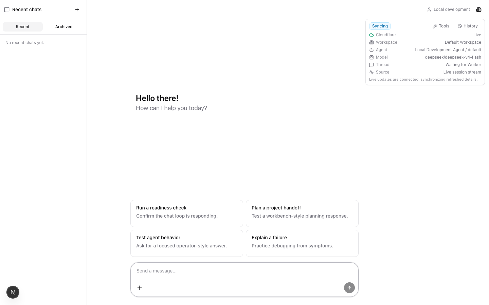
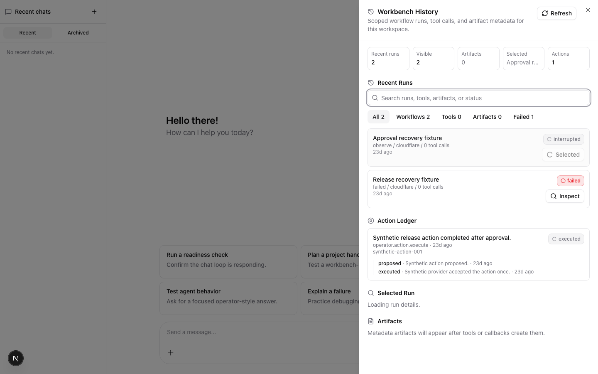
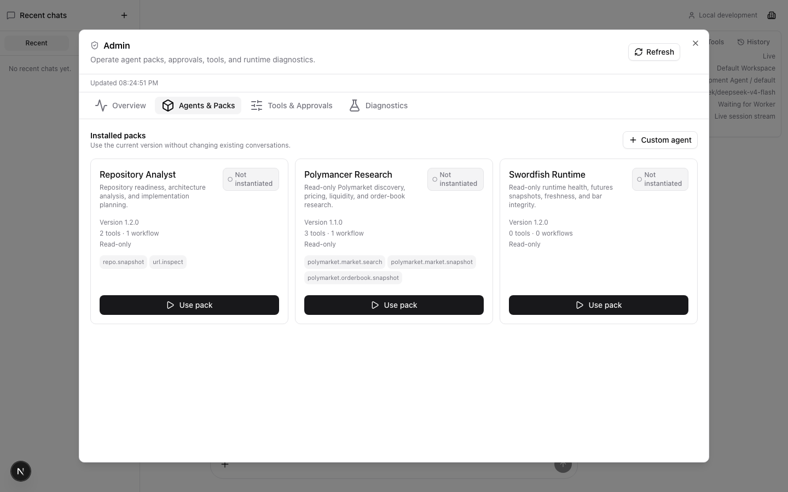
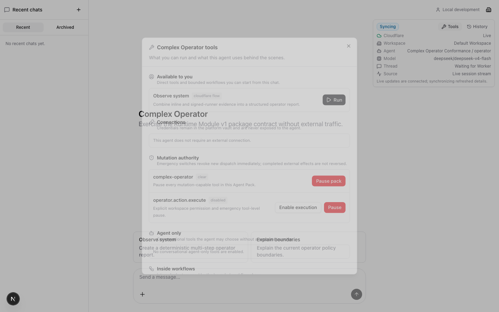
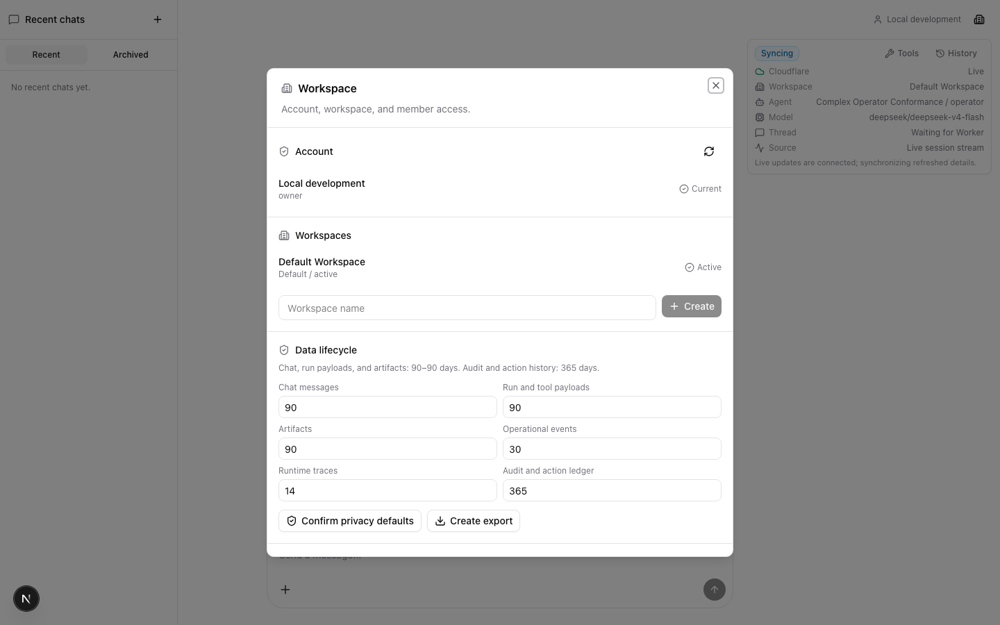

# Assistant-mk1

A code-first agent workbench for durable runs, approvals, tool policy, artifacts,
audit, and tenant-safe operations.

[](#release-status)
[](https://github.com/dawi369/assistant-mk1/actions/workflows/verify.yml)
[](LICENSE)

[Hosted workbench](https://assistant-mk1.vercel.app) ·
[Documentation](docs/README.md) ·
[Baseline readiness](docs/release-readiness.md)

## Release Status

Assistant-mk1 is preparing the `1.0.0` production candidate: an authenticated,
tenant-scoped workbench targeting Operational L3 plus Authority A2. The code now
includes forward-only retained-data migrations, full workspace export and
deletion lifecycle, WorkOS Vault credential custody, OAuth/API-key brokerage,
and policy-controlled durable mutation. The release remains blocked until all
same-commit hosted gates in [Release Readiness](docs/release-readiness.md) pass.

## Product Tour

Assistant-mk1 keeps chat immediate while moving serious agent work into durable,
inspectable control-plane state. Runs, tools, approvals, artifacts, traces, and
tenant scope are visible outside the model conversation.



### Workbench

- Cloudflare Agents chat with optimistic new-chat rendering and durable threads.
- WorkOS-backed accounts, workspaces, memberships, roles, and agent selection.
- Searchable run history with cancellation, retry, reconnect, and approval recovery.
- Server-enforced tool visibility, execution modes, policy, and audit.



### Agent Operations

- Code-first Agent Pack API v2 with behavior, tools, workflows, managed state,
  read-only schedules/webhooks, connection declarations, risk, health, eval,
  and resource metadata.
- Durable unattended-failure alerts, bounded retention, and deterministic D1
  backup/restore evidence.
- Current-agent Tools separates user-run workflows, agent-only tools, and
  workflow-internal adapters.
- Typed workflows with bounded inputs, inspectable artifacts, durable action
  proposals, approvals, kill switches, and reconciliation.
- Signed per-trigger webhooks, Cloudflare schedules, and callback-backed
  Fly/LangGraph execution.
- Sentry and first-party runtime traces across Vercel, Cloudflare, and Fly.







## Why Assistant-mk1

Most agent starters optimize for the first chat response. Assistant-mk1 focuses
on what comes after that: who the agent acts for, which tools it can see, how
long-running work is controlled, where results live, and how an operator recovers
when execution fails or pauses for approval.

The base workbench stays domain-neutral. Product behavior belongs in agent packs,
workspace configuration, policy, tools, and integrations rather than hard-coded
application assumptions.

## Architecture

| Surface          | Responsibility                                                                               |
| ---------------- | -------------------------------------------------------------------------------------------- |
| Vercel / Next.js | WorkOS browser session, workbench UI, and signed same-origin facades                         |
| Cloudflare       | Authorization, D1 control state, Durable Object chat, policy, audit, events, and normal chat |
| Fly              | Signed heavy tool execution; runner transport is recorded separately from run orchestration  |
| LangGraph        | Graph-shaped orchestration only when an actual delegated run and external run id exist       |

Trusted tenant scope is derived server-side. The browser never chooses trusted
`userId`, `workspaceId`, `agentId`, or provider credentials.

See [Architecture](docs/architecture.md), [Tenancy](docs/tenancy.md), and the
[current topology](docs/diagrams/current-implementation-topology.mmd).

## Quick Start

Requirements:

- Node.js 22
- pnpm 10.33.0
- an OpenRouter API key

```bash
pnpm install --frozen-lockfile
cp .env.example .env.local
cp cloudflare/control-plane/.dev.vars.example cloudflare/control-plane/.dev.vars
```

Set `OPENROUTER_API_KEY` in both local environment files and make the local
transport tokens match. Apply the local D1 migrations:

```bash
pnpm db:cloudflare:migrate:local
pnpm workbench:doctor --offline
```

The migration command preserves existing development data. The separate
`db:cloudflare:rebuild:*` commands drop Worker tables and are only for an
intentional reset.

Start the complete workbench:

```bash
pnpm dev:workbench
```

Then run `pnpm workbench:doctor` in another terminal to verify Worker reachability,
the D1 binding, matching transport secrets, and the bootstrapped local identity.

| Service           | Local URL               |
| ----------------- | ----------------------- |
| Next.js workbench | `http://localhost:3000` |
| LangGraph         | `http://localhost:2024` |
| Cloudflare Worker | `http://localhost:8787` |

Local development can use the explicit `WORKBENCH_ALLOW_LOCAL_DEV_IDENTITY`
fallback from `.env.example`. Hosted deployments fail closed and require WorkOS.

## Agent Packs

Agent packs are trusted build-time packages. Pack API v2 snapshots behavior and
declarations; Runtime Module v1 supplies schema-checked Cloudflare, Fly, and web
bindings without bypassing workspace policy or tenant authorization.

The bundled API v2 examples are **Repository Analyst**, **Polymancer Research**, and
**Swordfish Runtime**. Repository Analyst and Polymancer provide live, bounded,
read-only workflows. Swordfish is packaged and chat-capable, but intentionally
parked: it registers no executable tools, workflows, triggers, connections,
managed state, or renderers. Allowlisted
operators can reuse or instantiate the current pack version from Admin without
mutating older agent snapshots.

```bash
pnpm agent-packs:create --id my-agent --name "My Agent" --dry-run
pnpm agent-packs:compile --check
pnpm agent-packs:validate
pnpm agent-packs:inspect --pack repo-analyst
pnpm agent-packs:smoke --pack repo-analyst # static manifest/registry mapping smoke
pnpm agent-packs:test --pack repo-analyst  # executable package health/eval gate
pnpm conformance:agent-system              # aggregate SDK/compiler/runtime gate
pnpm test:service-boundaries               # live local Worker/Fly/browser workflow smoke
```

Installing a package requires its files, one `workbench.config.ts` entry, and a
deterministic compile. Packs can declare brokered connections and mutation
bindings, but cannot grant themselves credentials or authority. Remote
executable installation remains unsupported. See [Agent Packs](docs/agent-packs.md),
the [Agent Runtime Kit](docs/agent-runtime-kit.md),
the [Capability Model](docs/capability-model.md), and
[Agent Profile Authoring](docs/agent-profile-authoring.md).

## Verification

```bash
pnpm docs:check     # validate local documentation and image links
pnpm verify:fast   # packs, eval posture, unit tests, types, lint, format
pnpm verify        # fast gate, high-severity audit, and production build
pnpm test:e2e      # signed-out and trusted-local browser journeys
pnpm conformance:level2       # executable Level 0-2 evidence report
pnpm conformance:level3       # executable local Level 3 evidence report
pnpm conformance:agent-system # executable package and extension-system report
pnpm conformance:data-lifecycle # retention, export, recovery, and purge
pnpm conformance:connections    # Vault and OAuth/API-key brokerage
pnpm conformance:actions        # policy-controlled synthetic mutation
pnpm verify:docker            # non-root image and excluded-context proof
pnpm acceptance:hosted:public # hosted unauthenticated health parity
pnpm acceptance:hosted:level3:preflight # read-only hosted prerequisites
pnpm acceptance:hosted:level3 # guarded non-customer hosted failure drills
pnpm acceptance:hosted:vault  # guarded WorkOS Vault lifecycle evidence
pnpm acceptance:hosted:mutation # guarded isolated synthetic mutation evidence
pnpm release:check            # repository, Docker, and Level 2-3 local gates
```

The browser suite uses isolated D1 state under `output/playwright/`. Runtime
changes should also run the affected Cloudflare or Fly smoke documented in
[Contributing](CONTRIBUTING.md).

## Repository Map

- `app/assistant.tsx`: assistant-ui and Cloudflare Agents runtime bridge.
- `app/api/workbench/*`: signed Vercel facades over Cloudflare.
- `components/assistant-ui/*`: reusable assistant-ui composition.
- `components/workbench/*`: product workbench, history, workspace, and Admin UI.
- `cloudflare/control-plane/*`: Worker, D1 schema, Durable Objects, policy, and audit.
- `backend/agent.ts`: LangGraph graph and provider seam.
- `agent-packs/*`: code-first agent packages.
- `scripts/smoke-*.ts`: service-boundary and tenant-isolation checks.
- `docs/README.md`: authoritative current-state and target-contract map.

## Deployment

Deploy Cloudflare and Fly before a Vercel release that depends on them:

- [Environment separation and release evidence](docs/environment-separation.md)
- [Vercel](docs/deployment-vercel.md)
- [Cloudflare and local infrastructure](docs/dev-infrastructure-readiness.md)
- [Fly](docs/deployment-fly.md)

Production enablement is gated in order: retained data, connections, then
mutation for an isolated acceptance workspace. Migration, export, recovery,
purge, Vault, and mutation evidence are tracked in
[Migrations and Retention](docs/migrations-and-retention.md) and
[Release Readiness](docs/release-readiness.md).

## Contributing and Security

Read [CONTRIBUTING.md](CONTRIBUTING.md) before changing runtime boundaries.
Report vulnerabilities through [SECURITY.md](SECURITY.md), not a public issue.

This repository uses pnpm. Do not update the lockfile with npm or yarn.

## License

Assistant-mk1 is source-available under the
[PolyForm Noncommercial License 1.0.0](LICENSE). Noncommercial use is permitted
under those terms. Commercial use requires a separate written agreement; see
[Commercial Use](COMMERCIAL_USE.md).

This license is not an OSI-approved open-source license.

## Star History

[](https://www.star-history.com/#dawi369/assistant-mk1&Date)
